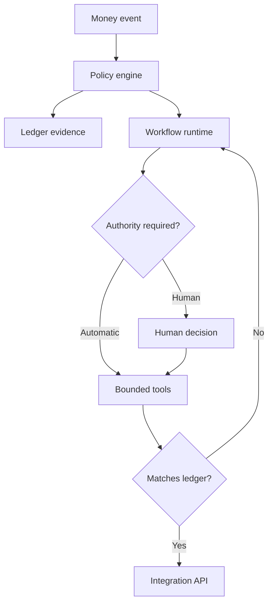

[← All work](https://github.com/J0UH) · [Money and operations systems](https://github.com/J0UH/money-operations-systems)

# MoneyOS

MoneyOS is my work on bringing bank payments, programmable assets, and settlement into one system people can actually operate.

Money moves through systems that describe it differently. A bank has an account entry. A contract has an on-chain balance. An application has a payment status, and an operator needs to explain how they all relate. Connecting the APIs is only the start.

What draws me to MoneyOS is the chance to work on that whole problem. The aim is a shared foundation for accounts, payments, assets, and the workflows around them, including work carried out by AI.

## Keeping the money and the work in step

A workflow can finish a task while the financial result is still pending. I keep those ideas separate. The operating process needs to know what to do next; the financial record needs to establish what actually happened.

That distinction shapes the account model, policy checks, and reconciliation path. It also gives an agent a smaller, clearer set of actions to work with. When a result does not match the ledger, the system needs a way to recover before reporting success.

MoneyOS brings together several strands of the portfolio. The payment, issuance, and settlement pages below go deeper into the individual problems.

## What the work covers

- Account and balance primitives
- Open-banking and account-to-account payments
- Programmable asset issuance and operation
- Same-chain and cross-chain settlement
- AI-operated financial workflows
- Policy and authority boundaries
- Evidence, reconciliation, and audit state
- APIs and tools for human and AI operators

A closer look at the technical flow

## Related work

- [Open finance and payments](https://github.com/J0UH/open-finance-payments)
- [Stablecoin and programmable asset infrastructure](https://github.com/J0UH/stablecoin-infrastructure)
- [Always-on blockchain settlement](https://github.com/J0UH/token-bridge-sdk)
- [Money and operations systems](https://github.com/J0UH/money-operations-systems)

Working on a similar problem? [Tell me what you are building](mailto:ju@jomena.group?subject=MoneyOS).

*This is a public account of the work. Source code and private operating details are not included in this repository.*
