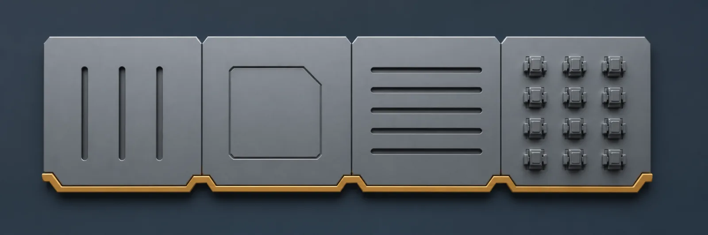
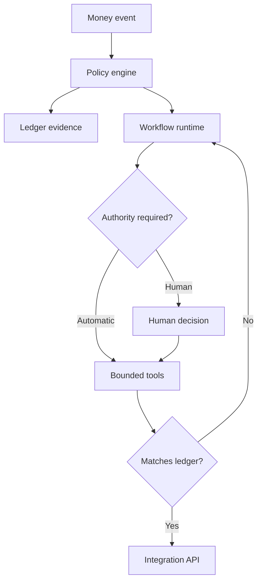

[← All systems](https://github.com/J0UH) · [Money and operations systems](https://github.com/J0UH/money-operations-systems)

  

# MoneyOS

MoneyOS brings accounts, open-banking payments, programmable assets, blockchain settlement, evidence, and AI-operated workflows into one coherent model. It is a way to connect banking and digital money without losing the controls people need in the real world.

## The engineering problem

Banking, payments, stable-value assets, on-chain settlement, and operations are often delivered as separate products with fragmented truth. The work focuses on reusable money primitives, explicit authority, shared evidence, and a system that both people and agents can operate safely.

## What the system covers

- Account and balance primitives
- Open-banking and account-to-account payments
- Programmable asset issuance and operation
- Same-chain and cross-chain settlement
- AI-operated financial workflows
- Policy and authority boundaries
- Evidence, reconciliation, and audit state
- APIs and tools for human and AI operators

## System shape

## Build notes

- Treat money state and workflow state as related but different concerns.
- Make every automated action explainable from durable inputs.
- Build for operational recovery, not only successful execution.

Public overview only. Source code, customer data, credentials, and private operating details are not included.

## Talk through a similar problem

Working on something similar? [Tell me about it](mailto:ju@jomena.group?subject=MoneyOS).
