[← Profile](https://github.com/J0UH) · [Money and operations](https://github.com/J0UH/money-operations-systems)

# MoneyOS

Cross-border settlement, brought together — bank payments, programmable assets, and the workflows that keep them in step.

*In production at [ARYZE](https://aryze.io). This page describes the system — not a product website. Implementation stays with the company that owns it — [about these pages](https://github.com/J0UH/J0UH/blob/main/ABOUT.md).*

## Problem

A cross-border payment is not an FX quote. It spans funding, identity and permissions, screening, conversion, token movement, custody, payout, and bank confirmation. Customers need one coordinated, traceable record of the payment — not a pile of disconnected provider statuses.

## What I built

MoneyOS is the coordinating service: customer requests become durable workflows that drive Aryze Core modules and external providers (banks, venues, wallet and identity systems, ledgers). It covers FX conversion, on/off-ramp flows, custody, settlement, account provisioning, and movement status through to bank credit.

## Key decisions

- **Separate the movement record from provider chatter.** One transaction reference survives quote, approval, conversion, recording, and completion. Sequence numbers discard stale updates.
- **Durable workflows, thin provider tasks.** Long-running payment work is saved and resumed; Core modules execute bounded provider steps with retries and clear receipts.
- **Adapters at the edge.** Banks, venues, wallets, and networks plug in through adapters — they are not embedded in the coordinating service.
- **Policy without holding the keys.** MoneyOS enforces policy and tracks exact transaction hashes and metadata. Signing material stays in separate security boundaries (bank / institution / wallet-provider MPC); the provider assembles and broadcasts.

## Architecture

```mermaid
flowchart LR
accTitle: MoneyOS
accDescr: Customer requests enter the MoneyOS API, become durable workflows that drive Core modules and provider adapters, then publish a sequenced movement record back to the customer view.
  customer["Customer systems"] --> api["MoneyOS API"]
  api --> wf["Durable workflows"]
  wf --> core["Aryze Core modules"]
  core --> adapters["Provider adapters"]
  adapters --> receipts["Receipts"]
  receipts --> journal["Journal / outbox"]
  journal --> view["Movement view"]
```

Core paths in the system:

- **Settlement** — burn / mint and chain settlement flows
- **Wallets** — provisioning and wallet operations
- **Trading** — on/off-ramp and venue flows
- **Custody** — withdrawals and banking callbacks
- **Accounts** — smart-account / identity provisioning

Payment shape end to end: funding confirmed → checks passed → source token burned → destination token minted → payout started → bank credit confirmed.

## Stack (indicative)

- **Coordination:** HTTP/OpenAPI edge, durable workflow runtime, journal/outbox messaging
- **Data:** relational stores per Core module; sequenced movement updates to the customer view
- **Domain modules:** settlement, wallets, trading, custody, smart accounts
- **External:** banks, venues, wallet/MPC providers, identity/screening, EVM contracts

Concrete vendors and deployment topology stay with the private implementations.

## Related work

- [Open finance and payments](https://github.com/J0UH/open-finance-payments)
- [Stablecoin and programmable asset infrastructure](https://github.com/J0UH/stablecoin-infrastructure)
- [Money and operations systems](https://github.com/J0UH/money-operations-systems)

Working on a similar problem? [Tell me what you are building](mailto:ju@jomena.group?subject=MoneyOS).
