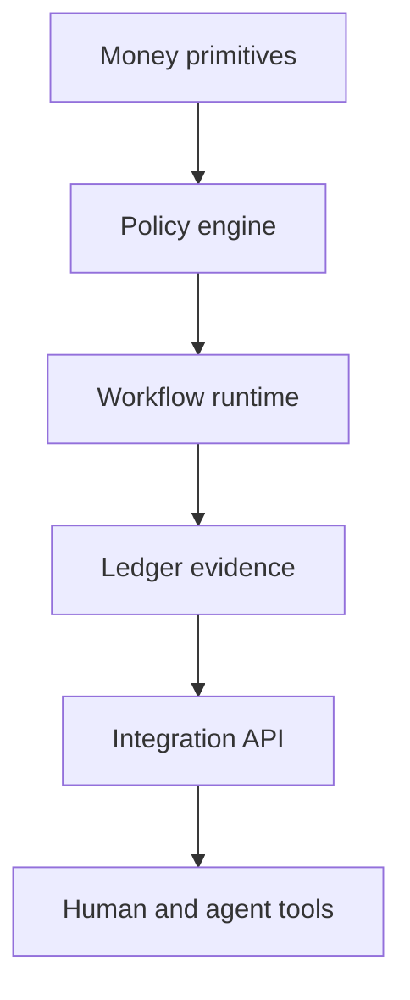

  

# MoneyOS

MoneyOS explores what changes when accounts, payments, rules, evidence, and automation share one coherent operating model. It is a way to make money movement programmable without losing the controls people need in the real world.

[Discuss a similar system](mailto:ju@jomena.group?subject=Discuss%20MoneyOS) | [Book a technical call](mailto:ju@jomena.group?subject=Book%20a%20technical%20call%20about%20MoneyOS)

## The engineering problem

Financial products often expose isolated features while the operational truth remains fragmented. The work focused on reusable money primitives, explicit authority, and a system that both people and agents can operate safely.

## What the system covers

- Account and balance primitives
- Programmable payment workflows
- Policy and authority boundaries
- Evidence, reconciliation, and audit state
- APIs and tools for human and agent operators

## System shape

## Build notes

- Treat money state and workflow state as related but different concerns.
- Make every automated action explainable from durable inputs.
- Build for operational recovery, not only successful execution.

Built under the Aryze umbrella. The underlying source and company IP remain private and owned by Aryze. Delivery involved people across engineering, product, operations, compliance, and design. Open-source foundations retain their original attribution and licences.

## Talk through a similar problem

If you are trying to build, untangle, or ship a system in this area, [send me a note](mailto:ju@jomena.group?subject=I%20need%20help%20with%20MoneyOS). If the problem needs a deeper technical conversation, [book a call by email](mailto:ju@jomena.group?subject=Book%20a%20technical%20call%20about%20MoneyOS).
